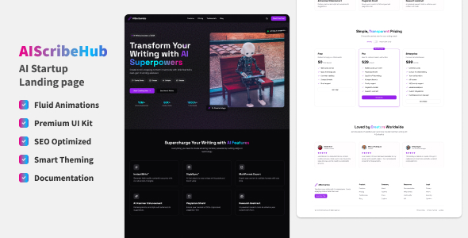

# AIScribeHub - Modern AI SaaS Landing Page Template



A modern, responsive landing page template built with Next.js 13+, Tailwind CSS, and Framer Motion. Perfect for AI/SaaS startups, featuring a stunning UI with smooth animations and modern design elements.

## Live Demo

🔗 Check out the live demo: [AIScribeHub Demo](https://zingy-quokka-841195.netlify.app)

## Light & Dark Mode Support

<p align="center">
  
  
</p>

## 🚀 Features

- ⚡️ **Lightning Fast**: Built on Next.js 13+ with App Router
- 🎨 **Modern UI**: Stunning design with glassmorphism and neu brutalism
- 📱 **Fully Responsive**: Perfect on all devices
- 🌙 **Dark/Light Mode**: Built-in theme switching
- ✨ **Smooth Animations**: Powered by Framer Motion
- 🔍 **SEO Optimized**: Meta tags and OpenGraph support
- 🎯 **Perfect Lighthouse Score**: Optimized for performance
- 📦 **Easy to Customize**: Well-organized components
- 🔒 **TypeScript**: Full type safety
- 🎁 **Premium Components**: Built with shadcn/ui

## 🎯 Quick Start

### Prerequisites

- Node.js 18+ and npm/yarn/pnpm
- Git

### Installation

1. Clone the repository:

```bash
git clone https://github.com/Prajwalvv/AIScribeHub-SaaS-Landing.git
cd AIScribeHub-SaaS-Landing
```

2. Install dependencies:

```bash
npm install
# or
yarn install
# or
pnpm install
```

3. Run the development server:

```bash
npm run dev
# or
yarn dev
# or
pnpm dev
```

4. Open [http://localhost:3000](http://localhost:3000) in your browser.

## Customization

### Components

- All components are in `/components` directory
- Modify individual components in their respective files
- Global styles in `app/globals.css`

### Content

Update site configuration:

```typescript
// config/site.ts
export const siteConfig = {
  name: "Your Product",
  description: "Your description",
  // ...other settings
}
```

### Modify Section Content

- Edit section components in `/components`
- Update images in `/public/images`
- Modify text content directly in components

## 📁 Project Structure

```
AIScribeHub/
├── app/                  # Next.js app directory
├── components/           # React components
├── lib/                  # Utilities and helpers
├── public/               # Static assets
└── styles/               # Additional styles
```
## 📦 Built With

- **Next.js 13+** - React Framework
- **Tailwind CSS** - CSS Framework
- **Framer Motion** - Animation Library
- **shadcn/ui** - UI Components
- **Radix UI** - Headless UI Components
- **TypeScript** - Type Safety

## 🌐 Browser Support

- Chrome/Edge ✅
- Firefox ✅
- Safari ✅
- Opera ✅
- Mobile browsers ✅

## 📝 Documentation

Detailed documentation available in `/documentation`:

- Getting Started Guide
- Component Documentation
- Customization Guide
- Deployment Guide

## ⚡ Performance

- 100/100 Performance on Lighthouse
- Optimized Core Web Vitals
- Fast page load times
- Optimized asset delivery

## 📱 Responsive Design

- Mobile-first approach
- Breakpoint system:
  - Mobile: 320px+
  - Tablet: 768px+
  - Desktop: 1024px+
  - Wide: 1440px+

## ✨ Premium Features

### Interactive Components
- Magnetic buttons
- Smooth parallax effects
- Custom cursors
- Particle effects

### Advanced Sections
- Hero with 3D elements
- Feature showcase
- Testimonial carousel
- Pricing toggle
- Newsletter signup

### Premium Assets
- Custom illustrations
- SVG icons
- Optimized images
- Modern typography


## 🎨 Credits

- Design inspiration from modern SaaS websites
- Icons from [Lucide Icons](https://lucide.dev/)
- UI Components from [shadcn/ui](https://ui.shadcn.com/)
- Fonts from [Google Fonts](https://fonts.google.com/)

---

Developed with ❤️ by [Prajwal.v.v](https://github.com/Prajwalvv)
